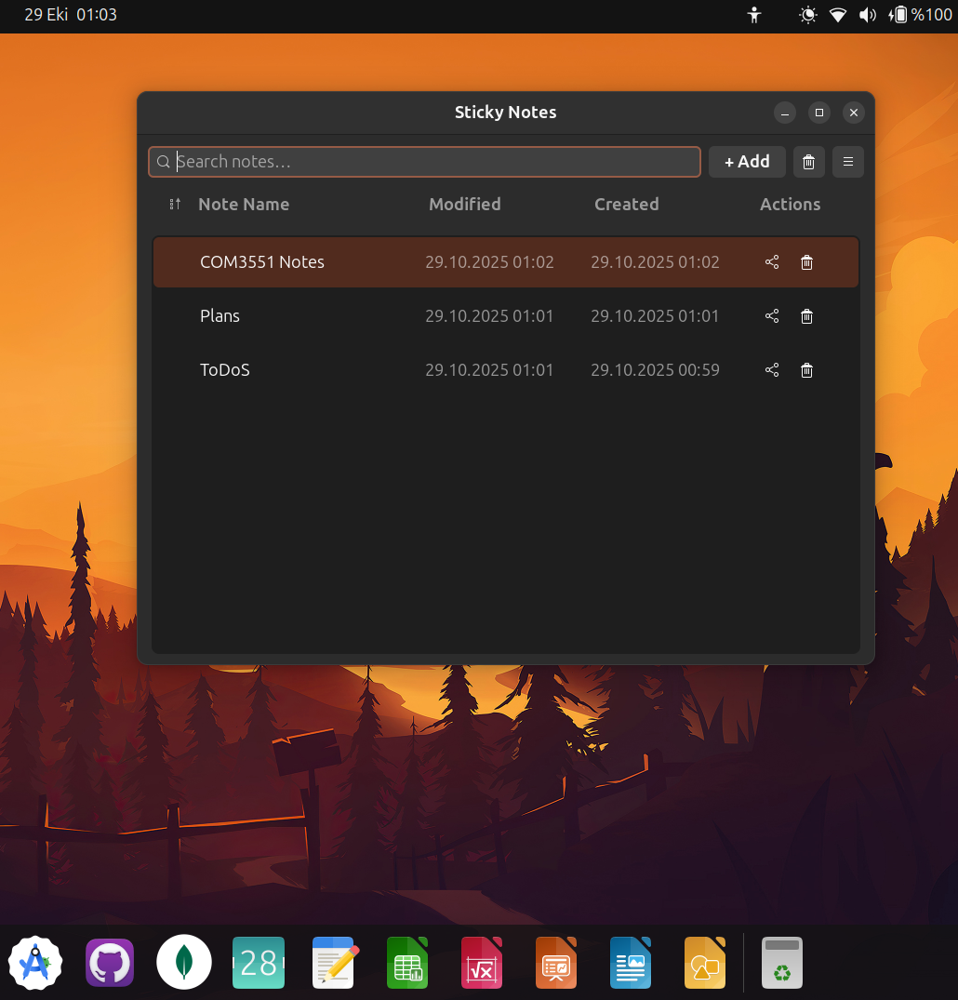
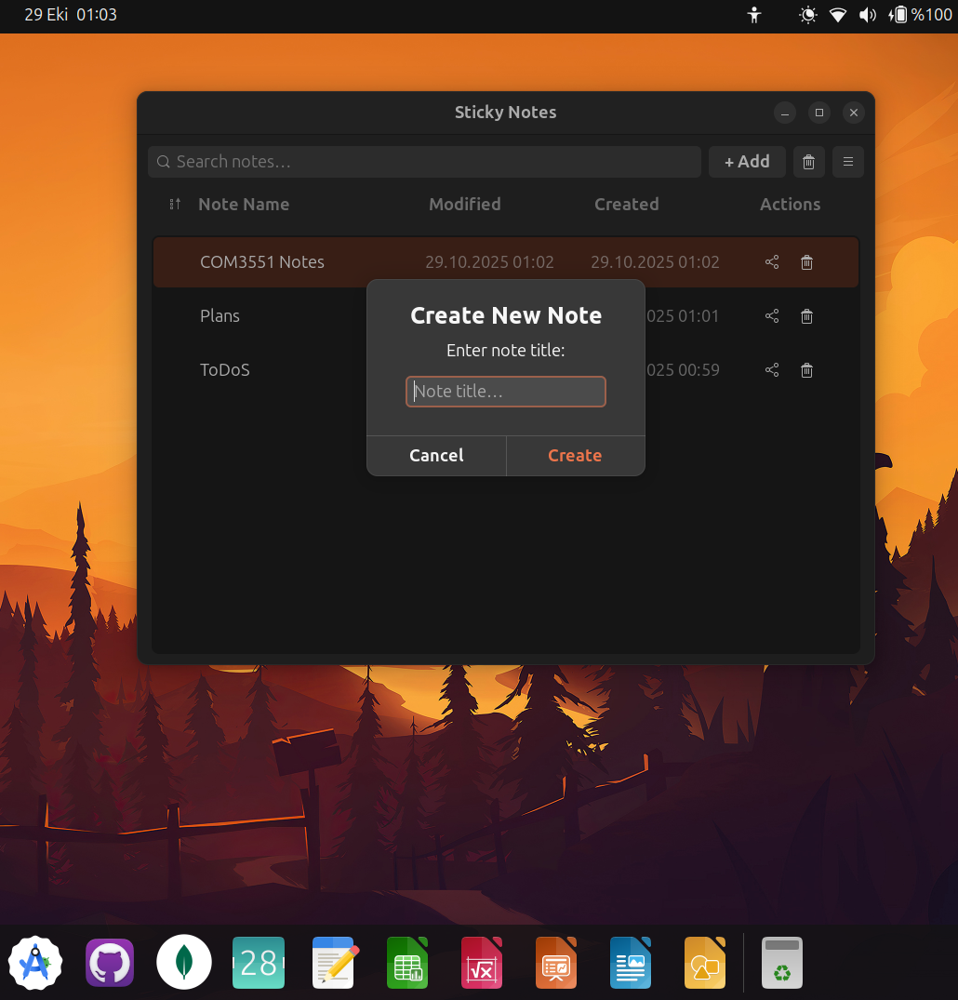
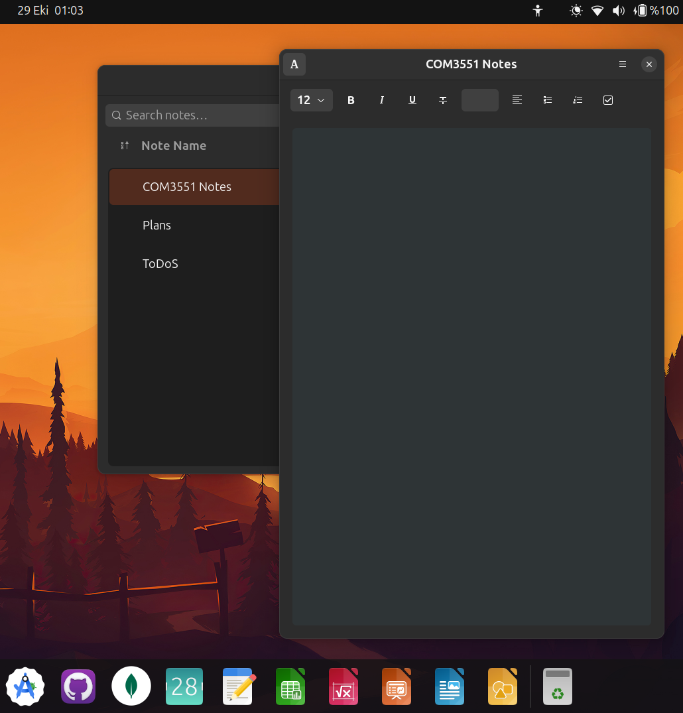

# Ubuntu Sticky Notes

A modern, fast, and beautiful sticky notes app for Linux, built with Python, GTK 4, and libadwaita.

[](LICENSE)
[](https://python.org)
[](https://gtk.org)
[](https://gnome.pages.gitlab.gnome.org/libadwaita/doc/main/)


## Screenshots



 


## Features

- **True Sticky Notes**: Notes stay on screen even when main window is closed - perfect for quick reminders!
- **Rich Text Editor**: Bold, italic, underline, colors, font sizes, alignment, and lists
- **10 Language Support**: English, Türkçe, Español, Français, Deutsch, 中文, हिन्दी, العربية, বাংলা, Русский - Switch instantly from the menu!
- **Clean Main Window**: Sortable columns, quick search, and clear actions
- **Auto-save**: Your content is continuously saved every few seconds
- **Session Restore**: Previously open notes are restored when app starts
- **Trash with Restore**: Deleted notes go to Trash - restore or permanently delete
- **Lightweight SQLite Backend**: Fast and reliable
- **Native GTK 4 UI**: Follows GNOME HIG with smooth libadwaita widgets


## Install

Ubuntu 22.04+ (or any distro with GTK 4 + libadwaita available). Recommended: run with the system Python so PyGObject (gi) bindings are provided by the OS.

### A) Run from source code

```bash
sudo apt update
sudo apt install -y \
  python3 python3-gi gir1.2-gtk-4.0 gir1.2-adw-1 git

git clone https://github.com/omercngiz/ubuntu-sticky-notes.git
cd ubuntu-sticky-notes

# Run the app - translations are already compiled!
python3 main.py
```

**Note for developers**: If you modify translation files (`.po`), run `python3 scripts/compile_translations.py` to regenerate `.mo` files.

If GTK/libadwaita bindings are missing, the app prints clear instructions and exits.

### B) Run from source (Virtualenv with system packages) (for devs)

PyGObject (gi) is provided by the OS, not pip. If you prefer a venv for your Python packages, create it with system site packages enabled:

```bash
python3 -m venv --system-site-packages .venv
source .venv/bin/activate

# Run the app - translations are already compiled!
python3 main.py
```
### C) Build a .deb package (for users)

```bash
sudo apt update
sudo apt install -y \
  python3 python3-gi gir1.2-gtk-4.0 gir1.2-adw-1 git

git clone https://github.com/omercngiz/ubuntu-sticky-notes.git
cd ubuntu-sticky-notes
chmod +x build_deb_package.sh
./build_deb_package.sh

# Install
sudo dpkg -i ubuntu-sticky-notes_*.deb || sudo apt -f install

# Uninstall later
sudo apt remove ubuntu-sticky-notes
```

## Troubleshooting

### “ImportError: No module named gi” or GTK bindings not found

Install required system packages:

```bash
sudo apt install -y python3-gi gir1.2-gtk-4.0 gir1.2-adw-1
```

Running in a venv? Use `--system-site-packages` as shown above.

## Usage

1. **Create a note**: Click "+ Add", enter a title, press Enter or click Create
2. **Edit notes**: Click on any note to open the editor - the sticky note window appears
3. **Format text**: Use the toolbar for bold, italic, colors, font sizes, alignment, and lists
4. **Keep notes visible**: Close the main window - your sticky notes stay on screen!
5. **Show main window**: Click the menu in any sticky note → "Show Main Window"
6. **Hide to background**: Main window menu → "Hide to Background" - app runs in background
7. **Delete notes**: Click the trash icon - notes go to Trash first
8. **Change language**: Menu → Language → Select your language → UI updates instantly!
9. **Sort notes**: Click the sort button to order by name, created date, or modified date
10. **Restore deleted notes**: Click Trash button to view and restore

### msgfmt not found when compiling translations (developers only)

```bash
sudo apt install -y gettext
```

### Where are my notes stored?

Your database is kept under the user data directory, typically:

```
~/.local/share/ubuntu-sticky-notes/stickies.db
```

It includes a `notes` table for content and a `settings` table for preferences (e.g., `language`).


## Contributing

Issues and PRs are welcome! Some easy ways to help:

- **Add translations**: Copy `locale/en.po`, translate it, run `python3 scripts/compile_translations.py`, and submit a PR
- **Improve existing translations** in `locale/*.po`
- Report UI/UX improvements or file bugs
- Test on different Linux distributions

See [CONTRIBUTING.md](CONTRIBUTING.md) for detailed guidelines.


## License

MIT © The contributors. See [LICENSE](LICENSE).

**Sürüm:** 2.0.0  
**Geliştirici:** Pavel Glukhov (Orijinal), Ömer Can Giz (Fork)  
**Repository:** https://github.com/omercngiz/ubuntu-sticky-notes
